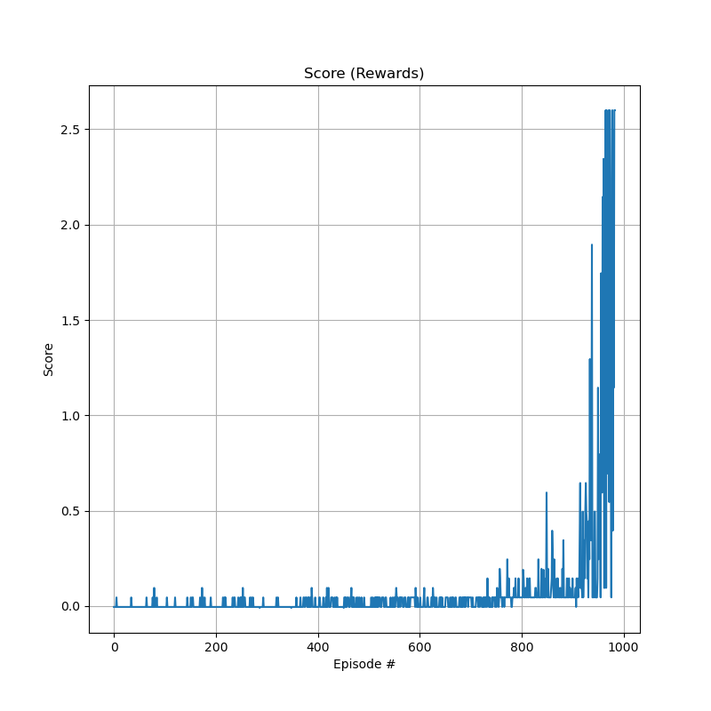
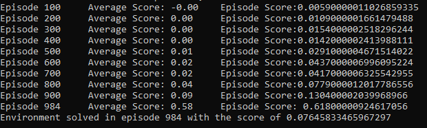
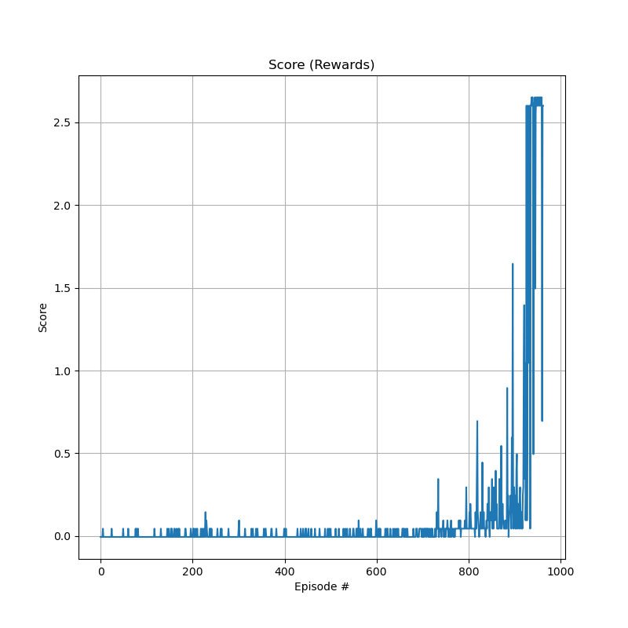
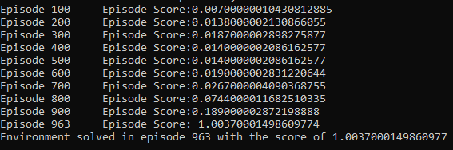

<h1> MULTI-AGENT TENNIS</h1> 

<h3><b> Vishal Anand S</b></h3>

# Problem Statement  

In this environment, two agents control rackets to bounce a ball over a net. If an agent hits the ball over the net, it receives a reward of +0.1. If an agent lets a ball hit the ground or hits the ball out of bounds, it receives a reward of -0.01. Thus, the goal of each agent is to keep the ball in play.  

The observation space consists of 8 variables corresponding to the position and velocity of the ball and racket. Each agent receives its own, local observation. Two continuous actions are available, corresponding to movement toward (or away from) the net, and jumping.

The task is episodic, and in order to solve the environment, our agents must get an average score of +0.5 (over 100 consecutive episodes, after taking the maximum over both agents). Specifically,

- After each episode, we add up the rewards that each agent received (without discounting), to get a score for each agent. This yields 2 (potentially different) scores. We then take the maximum of these 2 scores.
- This yields a single score for each episode.

The environment is considered solved, when the average (over 100 episodes) of those scores is at least +0.5.  

# Concepts
## Twin-Delayed Deep Deterministic Policy Gradient (TD3)
DDPG is a great algorithm for continuous control tasks but it is highly sensitive to hyperparameters. TD3 addresses these issues by stabilizing the learning with some simple but powerful methods. Q learning introduces bias due to the use of estimation to calculate an estimate and this process is carried out on DDPG as well. So the Q values approximated by the network is overestimated. TD3 introduces these methods to address this problem:

- <b>Clipped Q learning</b>: The critic network which is responsible for estimating the Q values return two instead on one Q values. While calculation we use the `min` of the two values.
- <b>Addition of noise</b>: Noise is added to the estimated actions which encourage the agent to explore and reduce exploitation.
- <b>Delayed policy update</b>: The policy network and soft updates are updated every two timesteps.  

You can read more about TD3 from [here](https://spinningup.openai.com/en/latest/algorithms/td3.html).

## Soft Actor Critic (SAC)
This is an algorithm to solve stochastic policies in an off-policy way. This is like a successor to the TD3 in some ways mainly due to its use of clipped Q learing method. The steps for SAC are as follows:
- Policy network output the actions and `log probs` from a normal distribution.
- `log probs` are used as entropy for the policy which encourages greater exploration.
- Policy is updated every two timesteps.
- `alpha` constant is used as the regularization parameter which is optimized using `Adam` optimizer.

You can read more about SAC from [here](https://spinningup.openai.com/en/latest/algorithms/sac.html).

# My Implementation
The implementation contains two agents which play against each other using a shared <b>Experience Replay Buffer</b>. Left racket is controlled by <b>SAC</b> and the right is controlled by <b>TD3</b>. The working steps are as follows:
- For each episode `states` are observed.
- Observed `states` are used to get actions from each individual agents.
- The `states`, `actions`, `rewards` and `next_states` are stored in a common <b>Replay buffer</b>.
- Experiences are sampled from the <b>Replay buffer</b> and the agents are trained using the shared experiences.
- The above step is performed until the end of an episode (`np.any(dones) == True`).

## Run #1
During the first run, I set the goal to 0.6, which means when the average max scores over 100 episodes reaches this threshold, the environment is considered solved. The score graph is produced below.  

 

 
As you can see initially the scores are low. This is caused due to exploration nature of the agents. During the run, the right agent (TD3) explored more than SAC and scored more than 600 points compared to the formar which was around 220. SAC's exploration is much more stable compared to TD3 which allowed it to gain the stability around 800 episodes. Environment was solved with 984 episodes as shown below:  
 
 

  

## Run #2
During the second run, the goal was set to 1.0 and the time steps were increased significantly (just to be safe!). The score graph is presented below:  
 

 
The s reason why score graph looks similar to the above is due to the nature of the agents. During both the runs the agents intially explored in depth of the environmentd using the randomness in the training. Once it grasps the working of environment, the performance increases significantly better. As you can see, from episode 800 the agents start taking better actions and achieves better scores.  
 
 

 
The agent achieves the score above 1.0 with less episodes than the previous run. The reasons can be due to the initialization of weights (or) change in learning path although the seed was same for both the runs. I don't have an exact explanation for this, but it happened.

## Learning Parameters

| Params/Agents        | SAC           | TD3  |
| ------------- |:-------------:| -----:|
| lr      | 3e-3 | 3e-3 |
| Gamma      | 0.998      |   0.998 |
| policy delay | 2 timesteps      |    2 timesteps |

The batch size was 64 for the <b>Replay Buffer</b>

# What's Next
The idea behind this implentation came from the rewiew of last project in which they suggested me to try other agents like <b>TD3</b>,<b>SAC</b>,<b>PlaNet</b> and <b>Dreamer</b>. I managed to implement the first two but the last two is a challenge for me due to it's complexity. Maybe someday I'll manage to master those.
